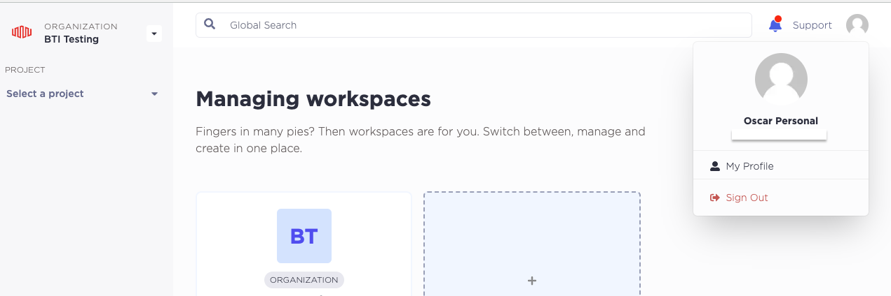

# Part 1: Setup

To run this workshop you will need access to an Equinix Metal account and a GitHub account.  If you do not have an Equinix Metal account, you can create a new one following step 1 below.  If you do not have a GitHub account, you can create one by following the [GitHub docs for creating an account](https://docs.github.com/en/get-started/signing-up-for-github/signing-up-for-a-new-github-account).

> **_Note:_**  You are responsible for the cost of resources created in your Equinix Metal account while running this workshop.

## Steps

### 1. Create an Equinix Metal account

If you have never used Equinix Metal before, don't worry, you just need 2 minutes to [sign-up and create your first organization](https://console.equinix.com/sign-up). If you have any doubt you can watch our [Getting Started with Equinix Metal](https://www.youtube.com/watch?v=5Ax6fKBeg2U&t=153s) video.

### 2. Create an API key

API keys in Metal can be tied to your user or to a single project. For this workshop we will need a user-level API key.

> **_Note:_** Project API keys do not have access to the entirety of the API; some endpoints can only be used by personal API keys.

To create a new user API key, access your user Profile in the Equinix Metal console, click on the **User Icon**, and click **My Profile**.



- Select the `API Keys` tab.
- Click on `+ Add New Key`.
- Create a new key with `Read/Write` permissions.


### 3. (Optional) Install and Configure Metal CLI to verify token

If you like, you can confirm that your API key is working by installing and running `metal-cli`.

You only need to download a binary to start enjoying `metal-cli`, but you may want to check out the different [installation options](https://github.com/equinix/metal-cli/#installation).

Once installed you need to configure your credentials. To do this, execute `metal init` and provide the requested information.

Expected output:

```shell
$ metal init

Equinix Metal API Tokens can be obtained through the portal at https://console.equinix.com/.
See https://metal.equinix.com/developers/docs/accounts/users/ for more details.

Token (hidden): 
Organization ID [27703148-e7bf-4a2f-95cf-46e7dddb4bb8]: 
Project ID []: 

Writing /Users/Username/.config/equinix/metal.yaml
```

## Discussion

Before proceeding to the next part let's take a few minutes to discuss what we did. Here are some questions to start the discussion.

- Can we create API keys without manually using the portal?
