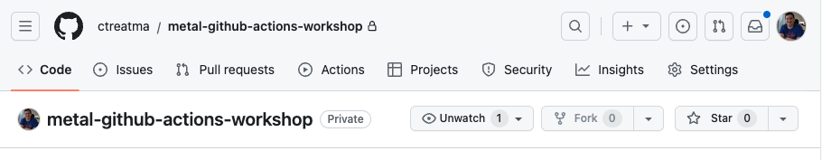

<!-- See https://squidfunk.github.io/mkdocs-material/reference/ -->
# Part 2: Create a GitHub Actions workflow

## Steps

### 1. Create a new GitHub repository

Create a GitHub repository by clicking the following link: <https://github.com/new?name=metal-github-actions-workshop>

The "Repository name" field will be pre-filled with `metal-github-actions-workshop`; if you prefer a different name feel free to change it.

If the "Owner" field says "Choose an owner", you must click the dropdown and select a user or organization that will own the new repository.


For the purposes of this workshop, the other form fields can be ignored.  Click "Create repository" to create your new GitHub repository.


### 3. Configure the `METAL_AUTH_TOKEN` GitHub Actions secret for your repository

In order to run our GitHub Actions workflow, we need to tell GitHub Actions what API token to use for interactions with the Equinix Metal API.  The token we will use is the user-level API token you created in [step 2 of part 1](./part1.md#2-create-an-api-key)

Click the `Settings` tab to navigate to the settings page for your repository.



On the left-hand side of the page, find the `Secrets and variables` option, click to expand it, and then click the `Actions` option underneath it.


Click the `New repository secret` button.  In the name field, type `METAL_AUTH_TOKEN`, and in the `Secret` field, paste your Equinix Metal API token.  Click `Add secret` to create the GitHub Actions secret.


### 2. Create a GitHub Actions workflow for your repository

Now that we have defined the `METAL_AUTH_TOKEN`, it's time to create and run our GitHub Actions workflow. Click the `Actions` tab to go to the GitHub Actions page for your repository.


On that page click the `set up a workflow yourself` link on the Actions page to open the form to create a new GitHub Actions workflow for your repository.


Copy and paste the yaml below into the text box on that page:

```yaml
name: 'metal-actions-example'

on:
  workflow_dispatch:

jobs:
  project:
    runs-on: ubuntu-latest
    steps:
    - name: Create temporary project
      id: metal-project
      uses: equinix-labs/metal-project-action@main
      with:
        userToken: ${{ secrets.METAL_AUTH_TOKEN }}
    - name: Use the Project SSH Key outputs (display it)
      run: |
        echo $PROJECT_PRIVATE_SSH_KEY
        echo $PROJECT_PUBLIC_SSH_KEY
      env:
        PROJECT_PRIVATE_SSH_KEY: ${{ steps.metal-project.outputs.projectSSHPrivateKeyBase64 }}
        PROJECT_PUBLIC_SSH_KEY: ${{ steps.metal-project.outputs.projectSSHPublicKey }}
    - name: Use the Project ID outputs (display it)
      run: |
        echo Equinix Metal Project "$PROJECT_NAME" has ID "$PROJECT_ID"
      env:
        PROJECT_ID: ${{ steps.metal-project.outputs.projectID }}
        PROJECT_NAME: ${{ steps.metal-project.outputs.projectName }}
    - name: Create device in temporary project
      uses: equinix-labs/metal-device-action@main
      continue-on-error: true
      with:
        metal_auth_token: ${{ steps.metal-project.outputs.projectToken }}
        metal_project_id: ${{ steps.metal-project.outputs.projectID }}
        metro: da
        plan: m3.small.x86
        os: ubuntu_22_04
    - name: Delete temporary project & device
      uses: equinix-labs/metal-sweeper-action@main
      with:
        authToken: ${{ secrets.METAL_AUTH_TOKEN }}
        projectID: ${{ steps.metal-project.outputs.projectID }}
```

Click "Commit changes" to commit the GitHub Actions workflow to your repository (you may be prompted to click a second "Commit" button).

### 5. Verify

This GitHub Actions workflow is configured with a `push` trigger and a `pull_request` trigger, so it will run automatically any time a commit is pushed to `main` and any time a Pull Request is opened.  This means that when you click "Commit changes" the workflow will run automatically.

Click the `Actions` tab again.  You should see `metal-actions-example` on the left-hand side, and a running workflow on the right-hand side (if you used the default values when you clicked the "Commit" button, the workflow probably says "Create main.yaml").


Click on the running workflow to see the workflow logs.


## Discussion

Before proceeding to the next part let's take a few minutes to discuss what we did. Here are some questions to start the discussion.

* Can you run additional tests on Equinix Metal resources before deleting them?
* What other events can trigger a GitHub Actions workflow?
* What kind of Equinix Metal resources can you create in a GitHub Actions workflow?

