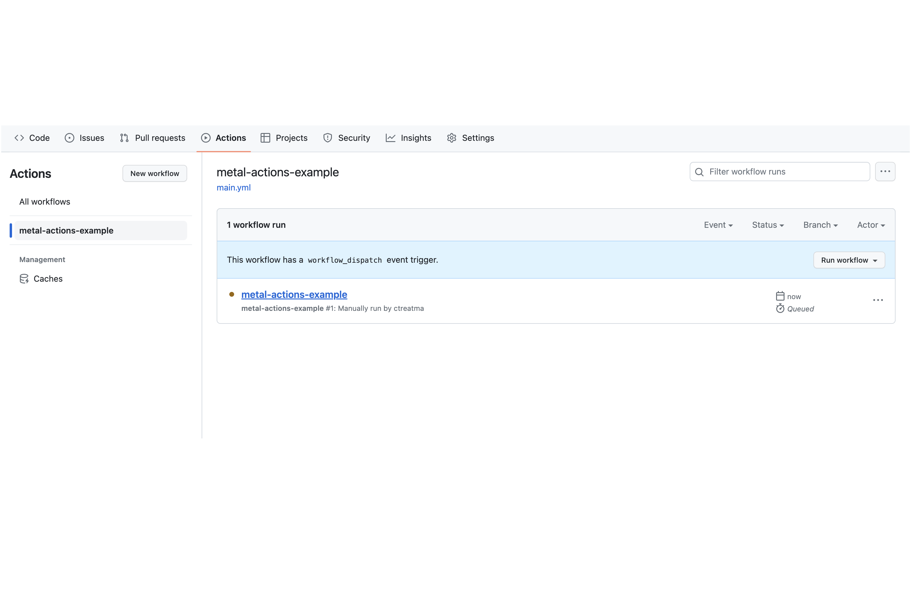

<!-- See https://squidfunk.github.io/mkdocs-material/reference/ -->
# Part 3: Understanding your GitHub Actions workflow

## Steps

### 1. Run your GitHub Actions workflow

This GitHub Actions workflow is configured with a `workflow_dispatch` trigger, which means it has to be run manually.

Click the `Actions` tab again.  You should see `metal-actions-example` listed on the left-hand side:

Click on `metal-actions-example` to see the details for that workflow

Click on the `Run workflow` button, and then click on the green button in the popup that appears:

After clicking the button, you may need to refresh the page to see the running workflow.  It should look like this:

In that view, the commit message (in this case, "Commit main.yml") is a link.  Click it to view the logs for the running workflow:

After a few minutes the workflow should complete successfully.

### 2. Examine the workflow logs

By looking at the logs for the completed GitHub Actions workflow, we can see what steps the workflow performed and think of ways to modify those steps for different use cases.

#### 2.1. Creating a temporary project

The first thing our workflow did--after building our custom GitHub Actions--was to create a temporary project using the `equinix-labs/metal-project-action` GitHub Action.  This action creates a new Equinix Metal project, creates a project token that only has access to the new project, and creates an SSH key inside the project.

There are a number of benefits to using the project token created by `equinix-labs/metal-project-action` in our CI/CD workflows:

* The CI test is confined to manipulating (and potentially breaking) the test Project resources
* The Project Key can be disposed of with the disposal of the project
* Leaked project keys have a narrow window of usability and minimized splash radius

#### 2.2. Creating a temporary device

Once the project is created, our workflow uses the `equinix-labs/metal-device-action`, configured with our limited-scope project token, to create an Equinix Metal device inside the temporary project.

In this example, we simply create a device and wait for it to finish provisioning.  In a real CI/CD workflow you might customize the device by passing in userdata, and you could use the project SSH key to log in to that device to check that it is running the way you expect it to.

#### 2.3. Deleting the temporary project & device

If a CI job fails, it may leave orphaned resources behind, which incur costs and pose security risks. These orphaned resources may also lead to failures in future jobs, whether because quotas are consumed or because other jobs find unexpected resources.

To alleviate this, our workflow uses the `equinix-labs/metal-sweeper-action` GitHub Action to delete all devices in our temporary project and then delete the project itself. Because the project is not known in advance, our workflow must use the user token we provided in `METAL_AUTH_TOKEN` in order to delete the project.

If you want to avoid putting user tokens into GitHub Actions secrets, you could create a dedicated, long-lived project for CI/CD testing instead of using `equinix-labs/metal-project-action`. In that case, you would configure GitHub Actions with a project token in `METAL_AUTH_TOKEN`, and you would configure `equinix-labs/metal-sweeper-action` with `keepProject: true` so that the sweeper will delete devices but will not attempt to delete the CI/CD project.

## Discussion

Before proceeding to the next part let's take a few minutes to discuss what we did. Here are some questions to start the discussion.

* Can you run additional tests on Equinix Metal resources before deleting them?
* What other events can trigger a GitHub Actions workflow?
* What kind of Equinix Metal resources can you create in a GitHub Actions workflow?

